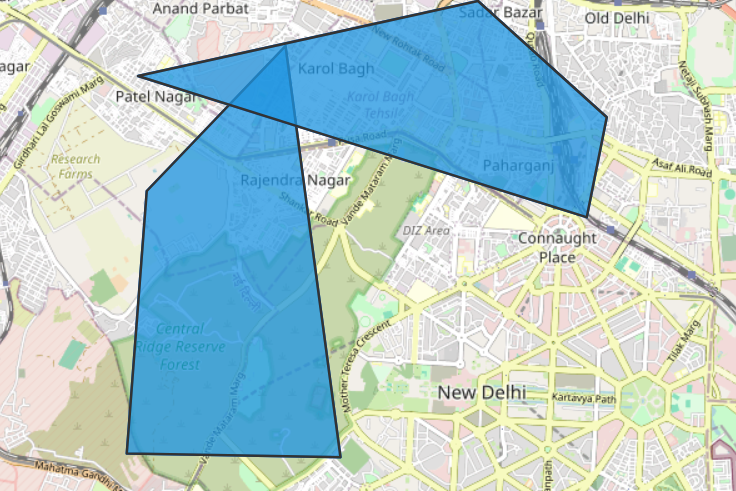
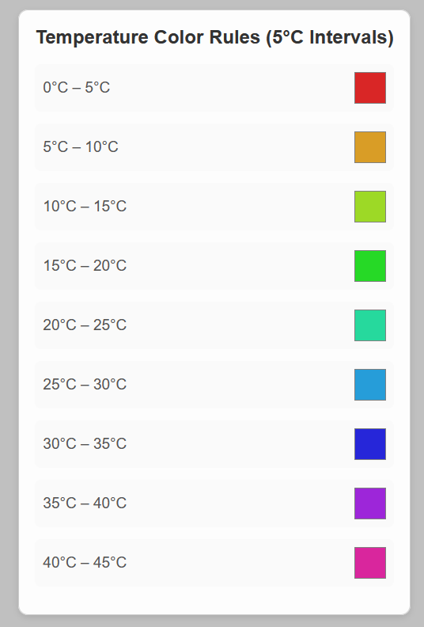
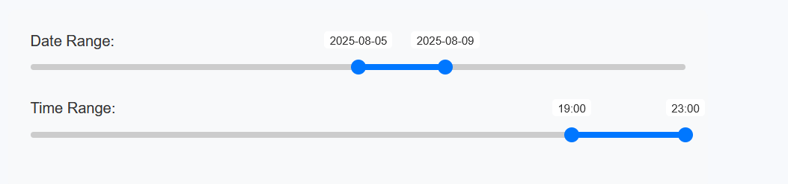
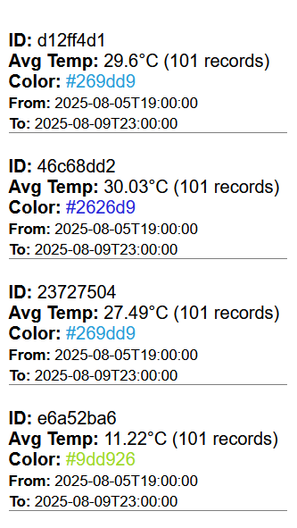
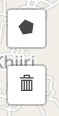
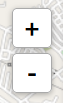

# 🌍 Mind Web Assignment

A dynamic geospatial data visualization tool built with **React**, **Leaflet**, and **Redux**. This app allows users to draw polygons on an interactive map and visualize temperature data over a selected **time range** using **Open-Meteo APIs**.

---

## 🚀 Technologies Used

- **React** — Frontend library for building user interfaces.
- **Redux Toolkit** — Efficient global state management.
- **TypeScript** — Static type-checking for reliable development.
- **Leaflet.js** — Lightweight interactive mapping library.
- **React-Leaflet** — React bindings for Leaflet.
- **Leaflet Draw** — Drawing tools (polygon drawing & deletion).
- **Open-Meteo API** — Free weather data (historical & forecast).
- **UUID** — Unique identifiers for polygons.
- **CSS Modules** — Styling components.

---

## 🛠️ Local Setup Instructions

Follow these steps to run the project locally:

### 1. Clone the repository

```bash
git clone https://github.com/SanjeevThalod/MindWeb.git
```

### 2. Install dependencies

```bash
npm install
# or
yarn install
```

### 3. Start the development server

```bash
npm run dev
# or
yarn dev
```

### 4. Open in browser

Visit: [http://localhost:5173](http://localhost:5173)

---

## 🌟 Features

- ✅ **Interactive Map** with Leaflet
- ✏️ **Polygon Drawing** (3–12 points)
- 📍 **Automatic Centroid Calculation**
- 🕒 **Time Range Selector** (Last 15 days, Today, Next 15 days)
- 🌡️ **Real-Time Temperature Fetching** via Open-Meteo
- 🎨 **Color Rules** based on temperature ranges
- 🧠 **Smart Caching** to avoid redundant API calls
- 🔄 **Dynamic Updates** based on timeline interaction
- 🧽 **Polygon Deletion** and proper sync with Redux + Map
- 📌 **Hover Tooltips** with temperature and ID info
- 📊 **Sidebar Information Panel** showing polygon metrics
- **API Caching** weather api is cached
- **Zoom Functionality** zoom in or zoom out

---


_You can use the Markdown below to embed them:_


### 🖼️ Polygon Drawing


### 🌡️ Tooltip & Temperature Coloring


###  Date & Time Slider


### List of All Polygons


### Buttons
Create or Delete Button

Zoom In or Zoom out


---

## 🧩 Folder Structure 

```
src/
├── components/
│   ├── PolygonDrawer.tsx
│   ├── PolygonRenderer.tsx
│   ├── PolygonUpdater.tsx
│   ├── TimelineSlider/
│   └── ...
├── store/
│   ├── store.ts
│   ├── polygonsSlice.ts
│   ├── timelineSlice.ts
│   └── ...
└── App.tsx
```

---

## 📬 API Reference

- **Open-Meteo Historical**

  Used for fetching past data
  ```
  https://archive-api.open-meteo.com/v1/era5
  ```

- **Open-Meteo Forecast**

  Used for fetching future data
  ```
  https://api.open-meteo.com/v1/forecast
  ```


## 🙋‍♂️ Author

Developed by **Sanjeev Singh Thalod** — [@your-github](https://github.com/your-username)

> Inspired by the need for intuitive weather data exploration on custom geographies.